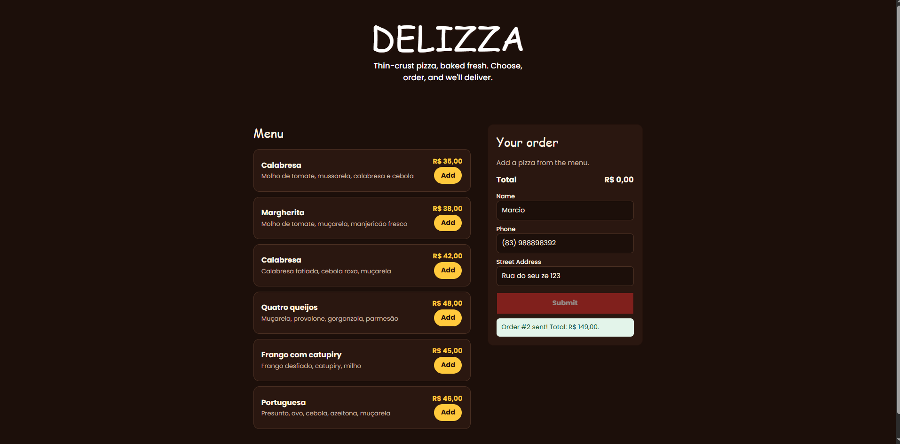

# Delizza

Delizza is a simple web application for ordering pizzas online. Users can view the menu, add pizzas to a cart, enter their delivery information, and submit an order.


To test the application, access the online, link: (https://delizza-omega.vercel.app/)
## Technologies

- HTML
- CSS
- JavaScript
- Node.js
- PostgreSQL

## Running the Project

### 1. Install dependencies

```shell
npm install
```

### 2. Configure the database

Create a `.env` file in the root directory and add your PostgreSQL connection and server port:

```env
DATABASE_URL=your_postgresql_connection_string
PORT=3000
```

### 3. Start the server

```shell
node server.js
```

The application will be available at: [http://localhost:3000](http://localhost:3000)

## API Endpoints

### Get Pizzas
* **URL:** `/api/pizzas`
* **Method:** `GET`
* **Description:** Returns the active pizzas available in the menu.

### Create an Order
* **URL:** `/api/orders`
* **Method:** `POST`
* **Description:** Receives the customer information and the pizzas selected in the cart.
